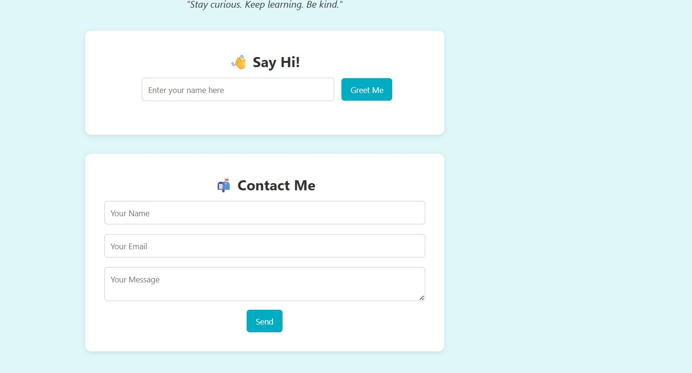

# My Profile Page

This project is a personal profile webpage designed using **HTML**, **CSS**, and **JavaScript**. It presents a formal self-introduction, a styled contact form, and an interactive greeting feature.

---

## 🌟 Objective

- Design a **professional and responsive** personal profile webpage.
- Demonstrate proficiency in **front-end technologies** by integrating structure, style, and interactivity.

---

## 🛠️ Tools Used

- **HTML5** – for content layout and structure  
- **CSS3** – for styling, spacing, and layout customization  
- **JavaScript** – for dynamic interaction (greeting feature)  
- **Visual Studio Code** – for writing and organizing code  
- **Web Browser** – for previewing and testing the webpage  

---

## 🚧 Steps Included

1. **Built** the HTML structure with:
   - A header section
   - A personal image
   - A short bio/introduction
   - A contact form

2. **Applied CSS3** to:
   - Ensure responsive layout
   - Maintain a clean and modern design
   - Style forms, buttons, and layout containers

3. **Implemented JavaScript** to:
   - Add an interactive greeting feature based on user input

4. **Organized Files**:
   - `index.html` – main HTML structure
   - `style.css` – styling rules
   - `script.js` – interactivity

5. **Captured Output Screenshots**:
   - 🎯 Page Screenshot  
   - 📝 Form Screenshot  

---

## 📸 Output Screenshots

> _Include the following screenshots in the repository for documentation:_

- **Page Screenshot**  
  

- **Form Screenshot**  
  

---

## ✅ Conclusion

This project showcases a **clean**, **formal**, and **interactive** personal profile page suitable for **academic** or **professional** purposes. It highlights core web development skills and serves as a **foundation** for building advanced personal or portfolio websites.

